# XMedia

    

XMedia is an easy-to-use photo, video, and audio editor application. Create stunning graphics and share them with your friends. Also, you can store your media files in Cloud securely.


## Introduction

Features of XMedia:
1.	Sign in with your Huawei ID easily.
2.	Add a filter, sticker, or resize to your photos.
3.	Enrich your videos with a rich array of video processing capabilities.
4.	Use powerful audio editing functions such as cutting, adding effects, extracting instruments, isolating vocals, or changing voice.
5.	Store your image, audio, or video files in Cloud.
6.	Play your audio and video files.
7.	Share your media files with your friends.


## About HUAWEI Account Kit

Account Kit provides you with simple, secure, and quick sign-in and authorization functions.

For more information -> [Huawei Account Kit Guide](https://developer.huawei.com/consumer/en/doc/development/HMSCore-Guides/introduction-0000001050048870)

## About HUAWEI Auth Service

Auth Service can quickly build a secure and reliable user authentication system for your app.

For more information -> [Huawei Auth Service Guide](https://developer.huawei.com/consumer/en/doc/development/AppGallery-connect-Guides/agc-auth-introduction-0000001053732605)

## About HUAWEI Audio Editor Kit

Audio Editor Kit provides a wide range of audio editing capabilities, including AI dubbing, audio source separation, spatial audio, voice changer, and sound effects.

For more information -> [Huawei Audio Editor Kit Guide](https://developer.huawei.com/consumer/en/doc/development/Media-Guides/introduction-0000001153026881)

## About HUAWEI Video Editor Kit

Video Editor Kit provides video editing capabilities like file import, video editing and rendering, video export, and material management.

For more information -> [Huawei Video Editor Kit Guide](https://developer.huawei.com/consumer/en/doc/development/Media-Guides/introduction-0000001101263902)

## About HUAWEI Image Kit

 Image Kit provides you smart image editing and design as well as animation capabilities into your app.

For more information -> [Huawei Image Kit Guide](https://developer.huawei.com/consumer/en/doc/development/Media-Guides/service-introduction-0000001050199011)

## About HUAWEI Audio Kit

 Audio Kit provides you with audio playback capabilities based on the HMS ecosystem, including audio encoding and decoding capabilities at the hardware level and system bottom layer.

For more information -> [Huawei Audio Kit Guide](https://developer.huawei.com/consumer/en/doc/development/HMSCore-Guides/introduction-0000001050749665)

## About HUAWEI Cloud Storage

 Cloud Storage provides you to store high volumes of data such as images, audio, videos, and other user-generated content securely and economically.

For more information -> [Huawei Cloud Storage Guide](https://developer.huawei.com/consumer/en/doc/development/AppGallery-connect-Guides/agc-cloudstorage-introduction-0000001054847259)

## About HUAWEI Cloud DB

 Cloud Storage provides data synergy management capabilities between the device and cloud, unified data models, and various data management APIs.

For more information -> [Huawei Cloud DB Guide](https://developer.huawei.com/consumer/en/doc/development/AppGallery-connect-Guides/agc-clouddb-introduction-0000001054212760)


## What You Will Need

**Hardware Requirements**
- A computer that can run Android Studio.
- Huawei mobile device with a USB data cable for running developed apps

**Software Requirements**
- Java JDK 1.8 or later
- Android Studio 2021.2.x
- Android SDK package
- Android API Level 26 or higher
- HMS Core (APK) 5.0.0.300 or later
- EMUI 8.0 or later

## Getting Started

XMedia uses HUAWEI services. To use them, you have to [create an app](https://developer.huawei.com/consumer/en/doc/distribution/app/agc-create_app) first. Before getting started, please [sign-up](https://id1.cloud.huawei.com/CAS/portal/userRegister/regbyemail.html?service=https%3A%2F%2Foauth-login1.cloud.huawei.com%2Foauth2%2Fv2%2Flogin%3Faccess_type%3Doffline%26client_id%3D6099200%26display%3Dpage%26flowID%3D6d751ab7-28c0-403c-a7a8-6fc07681a45d%26h%3D1603370512.3540%26lang%3Den-us%26redirect_uri%3Dhttps%253A%252F%252Fdeveloper.huawei.com%252Fconsumer%252Fen%252Flogin%252Fhtml%252FhandleLogin.html%26response_type%3Dcode%26scope%3Dopenid%2Bhttps%253A%252F%252Fwww.huawei.com%252Fauth%252Faccount%252Fcountry%2Bhttps%253A%252F%252Fwww.huawei.com%252Fauth%252Faccount%252Fbase.profile%26v%3D9f7b3af3ae56ae58c5cb23a5c1ff5af7d91720cea9a897be58cff23593e8c1ed&loginUrl=https%3A%2F%2Fid1.cloud.huawei.com%3A443%2FCAS%2Fportal%2FloginAuth.html&clientID=6099200&lang=en-us&display=page&loginChannel=89000060&reqClientType=89) for a HUAWEI developer account.

After creating the application, you need to [generate a signing certificate fingerprint](https://developer.huawei.com/consumer/en/codelab/HMSPreparation/index.html#3). Then you have to set this fingerprint to the application you created in AppGallery Connect.
- Go to "My Projects" in AppGallery Connect.
- Find your project from the project list and click the app on the project card.
- On the Project Setting page, set SHA-256 certificate fingerprint to the SHA-256 fingerprint you've generated.


## Using the Application

Upon completing the essential parts of the code, connect your mobile device to the PC and enable the USB debugging mode. In the Android Studio window, click the icon to run the project you have created in Android Studio to generate an APK. Then install the APK on the mobile device.

1.  Before you run the app, make sure that you have a working internet connection.
2.	Then, open the app upon installing it on your device.
3.  You see an OnBoarding Screen that introduces you to the app. Click the "Next" button to move to the next screen.
4.	To login into the app with your Huawei ID, click the "Sign in with HUAWEI ID" button.
5.	After logging in to the application, you should see Home Screen which contains Video Editing, Audio Editing, and Sound Editing features.
6.  When you click the "Video Edit" button, you will be taken to Video Editing Screen. After the import your video file, you can use the editing function.
7.  When you click the "Image Edit" button, you will be taken to the Image Editing Screen. After adding your image file, you can add a filter, sticker or, resize to your image.
8.  When you click the "Sound Edit" button, you will be taken to Sound Editing Screen. After the import your audio file, you can use the editing function.
9.	By clicking the "Projects" button on the bottom navigation, you can see your media files stored both in local storage and in the cloud.
10.	By clicking on any media item on the Project Screen, you can navigate to the detail screen of that item. You can play your sounds, and videos or see your images. 
11.	On Audio Player, Video Player ,and Image Viewer Screen, you can upload your media files to the Cloud.
12.	On the Settings Screen, you can log out of the app or navigate to the pages such as "About Us", "Privacy Policy", and "Terms and Conditions"


## Screenshots

<table>
<tr>
<td>
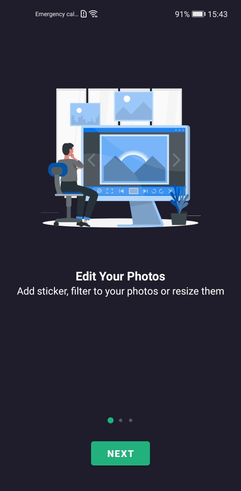 
</td>
<td>
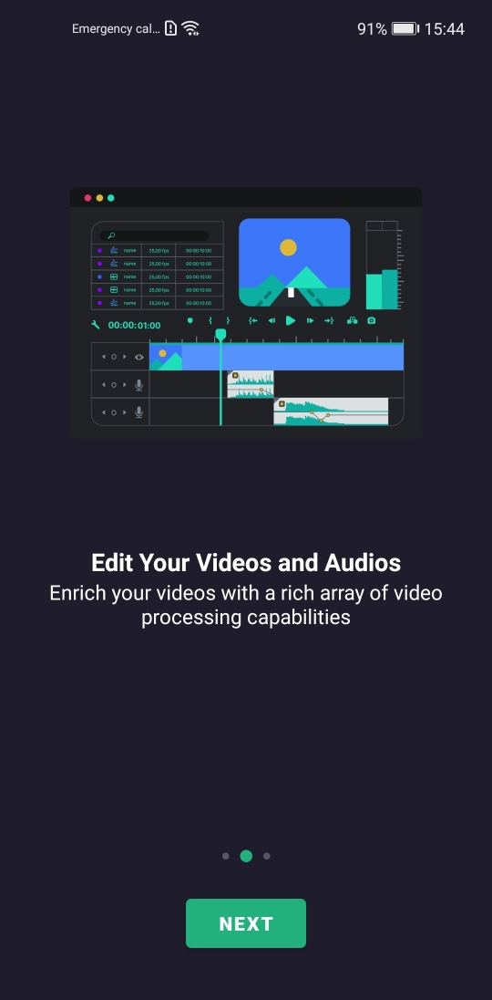 
</td>
<td>
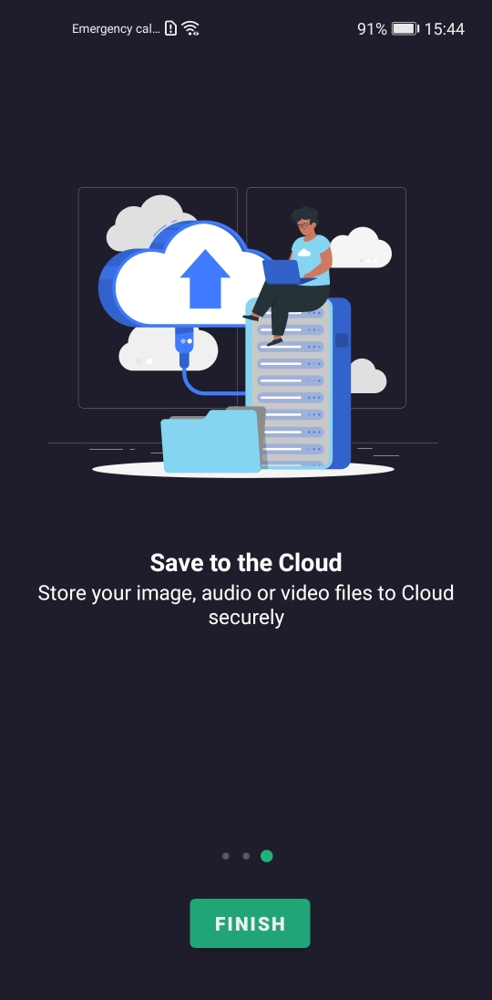
</td>
<td>
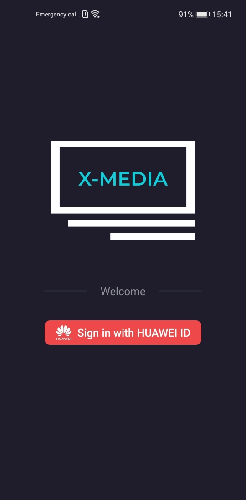
</td>
</tr>

<tr>
<td>
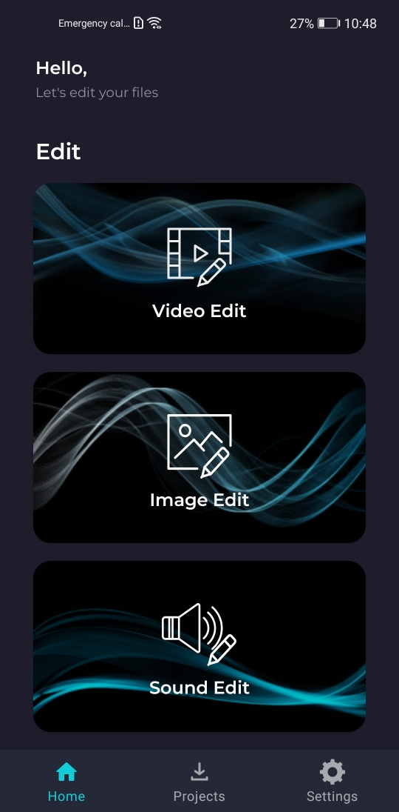
</td>
<td>
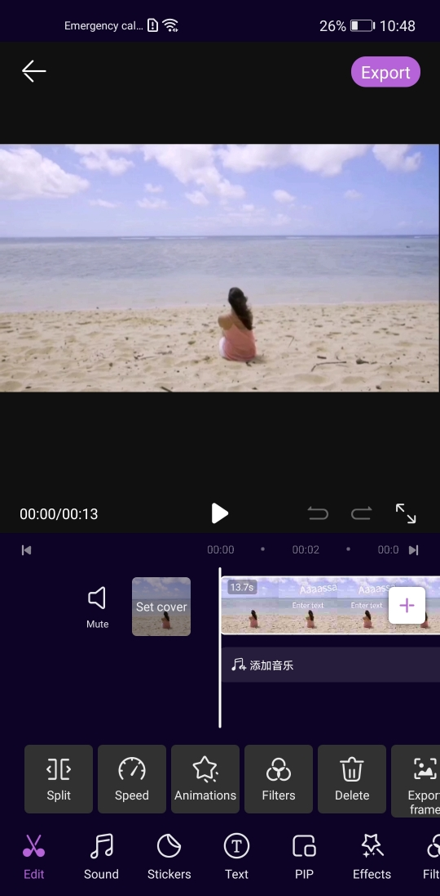
</td>
<td>
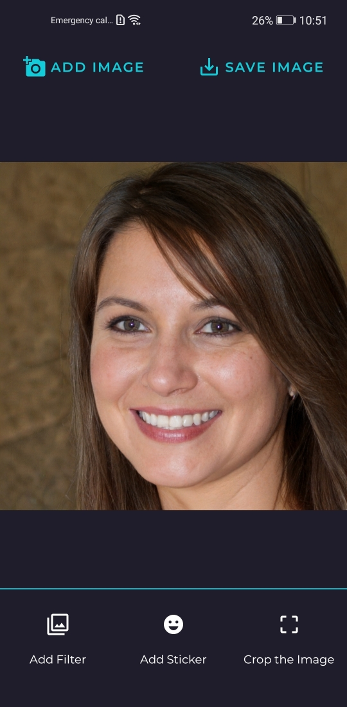 
</td>
<td>
 
</td>
</tr>

<tr>
<td>
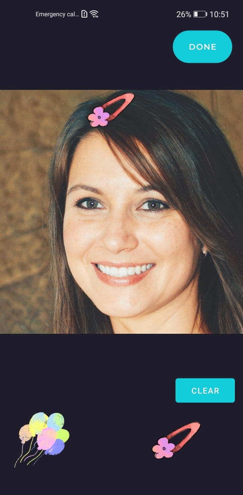
</td>
<td>
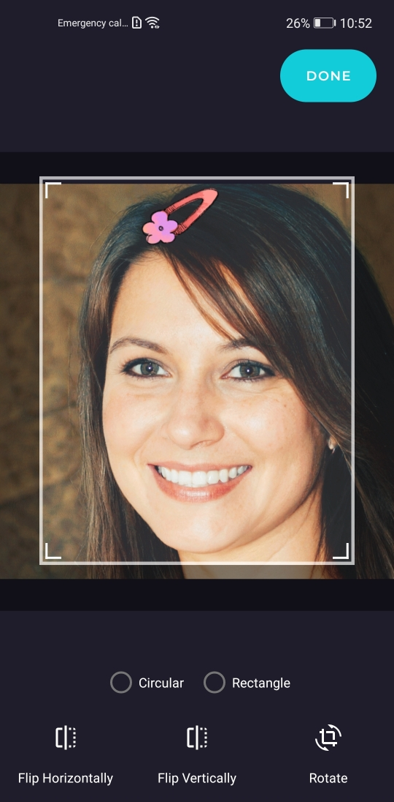 
</td>
<td>
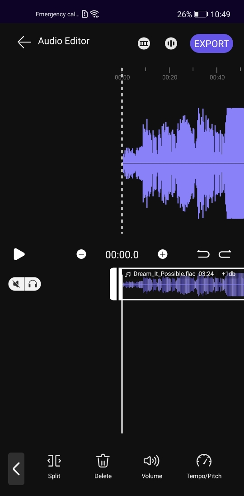 
</td>
<td>
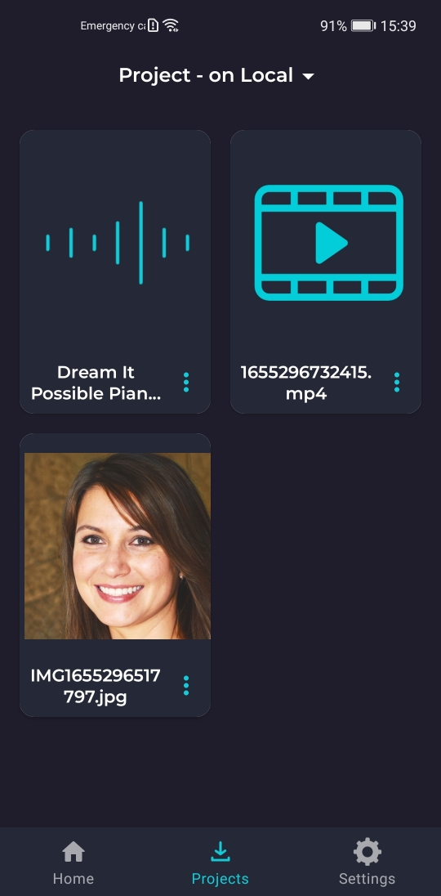
</td>
</tr>

<tr>
<td>
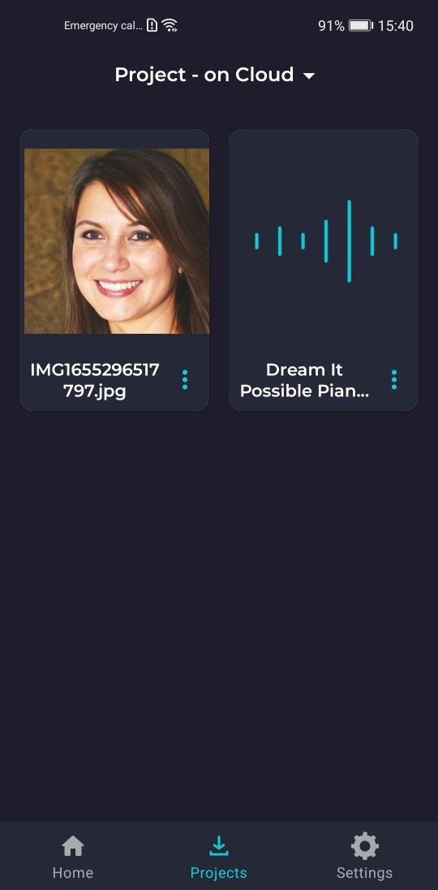 
</td>
<td>
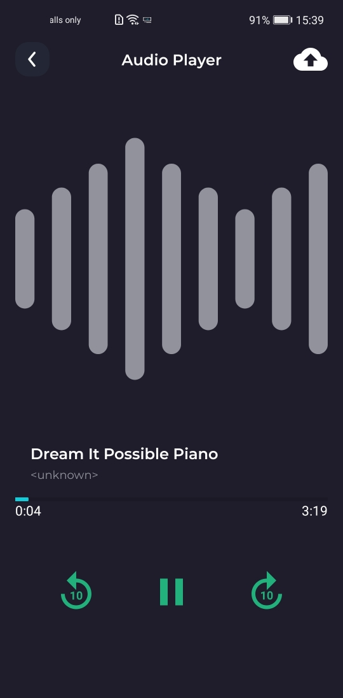
</td>
<td>
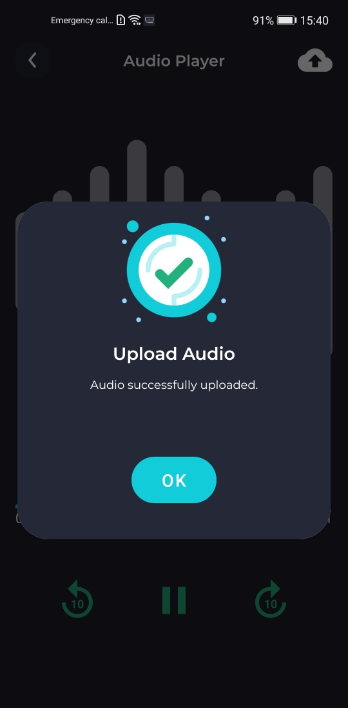
</td>
<td>
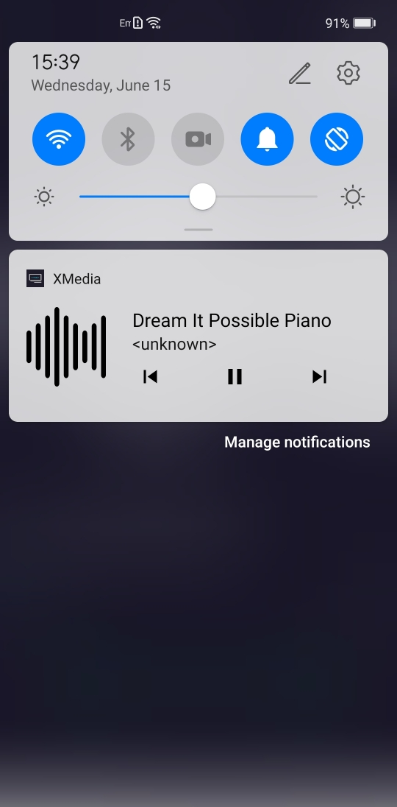
</td>
</tr>

<tr>
<td>

</td>
<td>
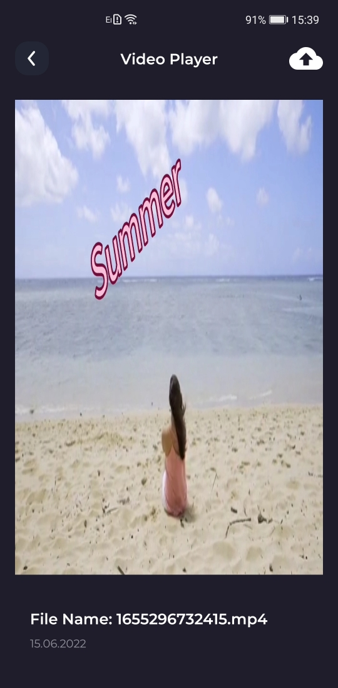
</td>
<td>
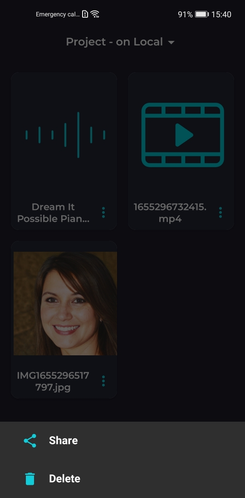
</td>
<td>
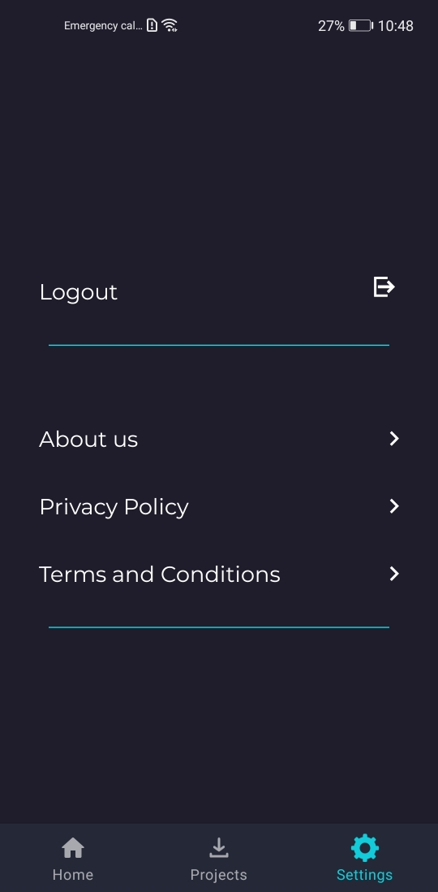
</td>
</tr>
</table>

## Project Structure

XMedia is designed with MVVM design pattern.

## Libraries
- Huawei Account Kit
- Huawei Auth Service
- Huawei Audio Editor Kit
- Huawei Video Editor Kit
- Huawei Image Kit
- Huawei Audio Kit
- Huawei Cloud Storage
- Huawei Cloud DB
- Dagger Hilt
- Kotlin Coroutines
- LiveData
- ViewModel
- Navigation
- ViewBinding
- DataStore
- Glide
- Lottie
- Circle Indicator

# License
```xml

 Copyright 2022. Explore in HMS. All rights reserved.

 Licensed under the Apache License, Version 2.0 (the "License");
 you may not use this file except in compliance with the License.
 You may obtain a copy of the License at

 http://www.apache.org/licenses/LICENSE-2.0

 Unless required by applicable law or agreed to in writing, software
 distributed under the License is distributed on an "AS IS" BASIS,
 WITHOUT WARRANTIES OR CONDITIONS OF ANY KIND, either express or implied.
 See the License for the specific language governing permissions and
 limitations under the License.

```